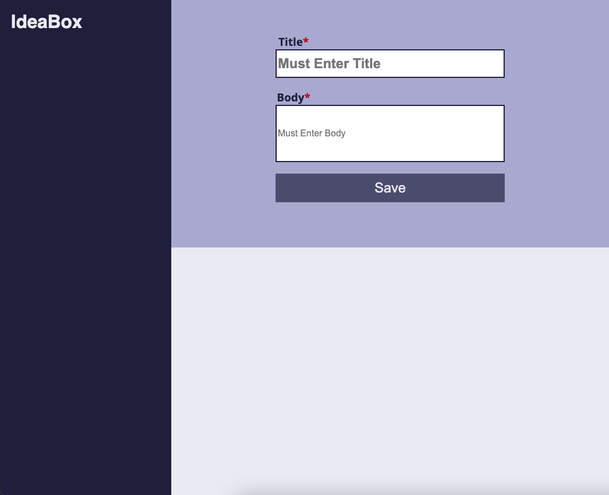
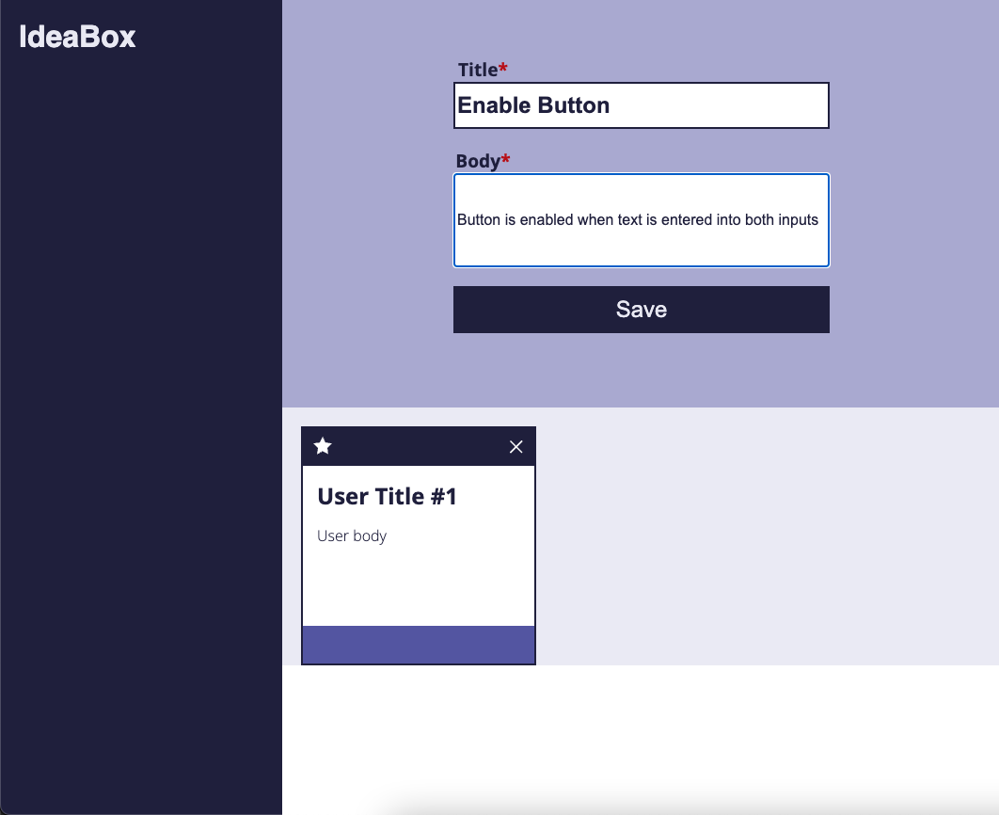

## Overview

Ideabox is an app designed to save your ideas in an easily accessible format. Users are able to create new ideas by saving their custom ideas into separate cards which can then either be favorited or deleted.

Ideabox was built by Lee Young, Matthew Press, and Scott Gaines from a previously-set comp provided by Turing School of Software and Design. It uses one html document (index.html), one css styling document (styles.css), two javascript documents (main.js and Idea.js), and an assets directory of svg images.

## Installation Steps

1. Fork and clone this repo to your local machine.
2. Run 'cd ideabox' in your command line to move into the root directory.
3. Run 'open index.html' in your command line to open the application in your browser.

## Using the App

1. Enter a title for your idea in the Title field.
2. Enter a description of your idea in the Body field.
3. Click the Save button to save your idea and display it to the screen.

## Developer LinkedIns

- Lee Young: https://www.linkedin.com/in/leah-young-17b148166
- Matthew Press: https://www.linkedin.com/in/matthew-press-813961246/
- Scott Gaines: https://www.linkedin.com/in/scottdgainesfe

## Dev Reflections and Notes

The project consisted of four iterations plus optional extensions. As a team, we successfully completed the first three iterations in full, including a full refactoring session. The original comp called for a few features that are not included in our final submission (eg: menu in the nav bar, a "Show Saved Ideas" button, and a comment button at the bottom of the cards). We included these in the initial version of the app, but in the interest of the user, removed them when refactoring as their functionality was not built out.
